  # 💼 InvestasiApp - Simulasi Investasi Saham & SBN

InvestasiApp adalah aplikasi berbasis Java console yang memungkinkan pengguna melakukan simulasi investasi dalam bentuk **Saham** dan **Surat Berharga Negara (SBN)**. Aplikasi ini menyediakan dua peran utama: **Admin** dan **Customer**, dengan fitur pengelolaan dan pembelian investasi.

---

## 🧩 Fitur Utama

### 👨‍💼 Admin
- Tambah, ubah harga, dan hapus **Saham**
- Tambah dan hapus **SBN**
- Lihat seluruh daftar investasi yang tersedia

### 👤 Customer
- Melihat daftar investasi
- Membeli saham berdasarkan harga dan nominal
- Membeli SBN selama masih tersedia kuota nasional
- Melihat portofolio investasi pribadi

---

## 🏁 Cara Menjalankan

1. Pastikan Anda telah menginstal **Java JDK 17 atau lebih baru**
2. Clone repositori ini:

```bash
git clone https://github.com/username/InvestasiApp.git
cd InvestasiApp
```

---

## 📖Cara Penggunaan Aplikasi
InvestasiApp dapat dijalankan di **IDE INTELLIJ** dan pastikan kalian menginstal **JDK 11** Atau yang lebih baru.

### ℹ️Informasi Login 

| Role   | Username | Password   |
|--------|----------|------------|
| Admin  | admin    | admin123   |
| User   | user     | user123    |

Kode kami terdapat 2 role yang tersedia, yaitu **Admin** dan **User**. 

---

### 1. Tampilan Awal Program
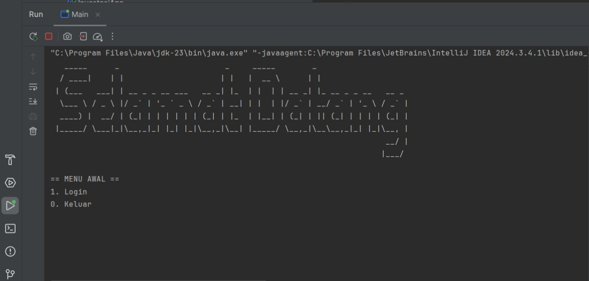
 
Gambar diatas merupakan **tampilan awal** saat kode program dijalankan. terdapat 2 opsi yaitu, **Login** dan **Keluar**.


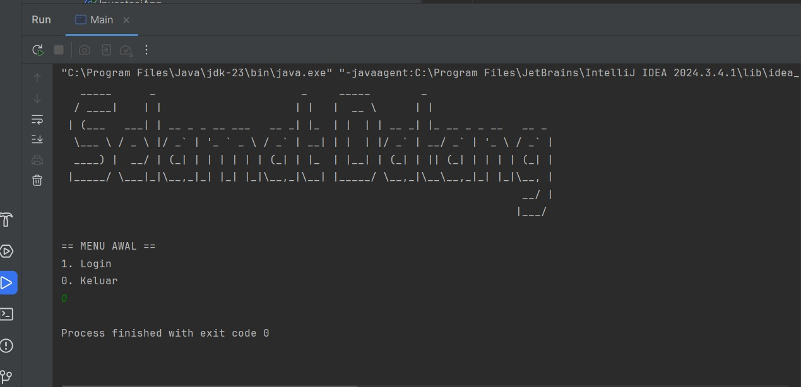

Gambar di atas merupakan tampilan kelar ketika pengguna memilih opsi keluar(0).

---
### 2. Admin Login
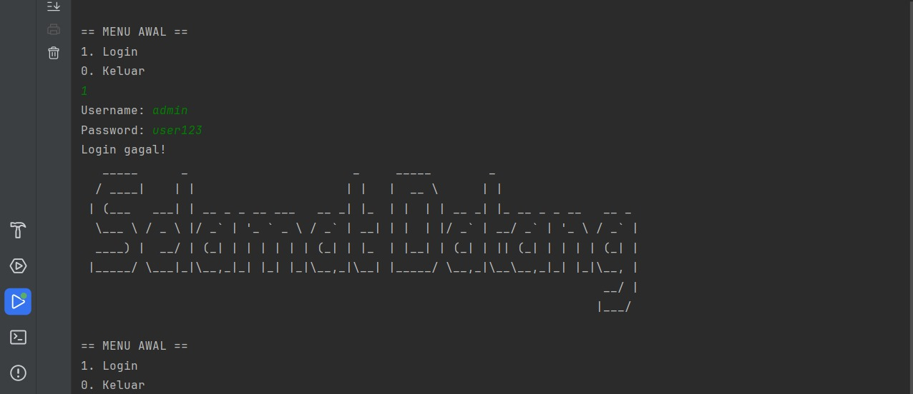

Gambar di atas merupakan tampilan login sebagai admin. Jika menginput username atau password yang salah, maka akan ada pesan seperti gambar di atas dan akan otomatis kembali ke menu login. Jika password dan username sudah benar, maka program akan berjalan ke tampilan selanjutnya.

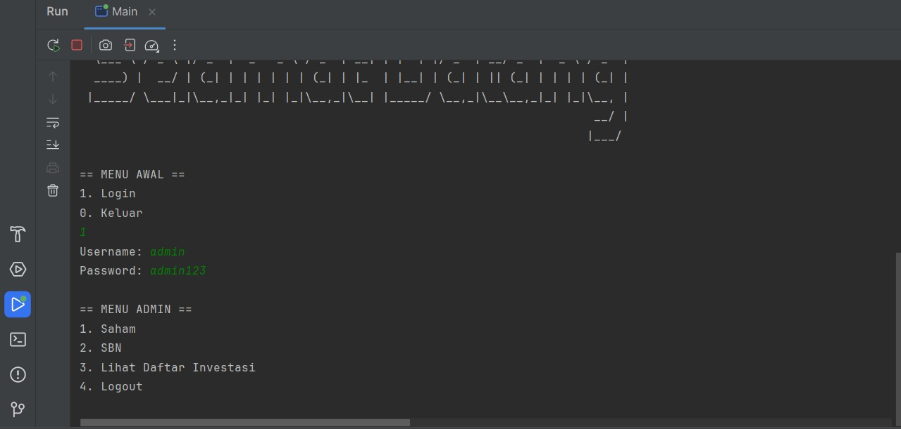

Gambar di atas merupakan contoh jika password dan username benar. Program akan menampilkan **Menu Admin** yang berisi opsi **Saham**, **SBN**, **Lihat Daftar Investasi**, dan **Logout**. 

---
### 3. Menu Saham
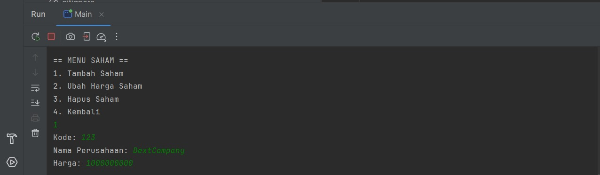

Gambar di atas merupakan tampilan ketika kita memilih opsi **Saham** pada **Menu Admin** yang dimana akan memunculkan **Menu Saham**. Disana terdapat **Tambah Saham**, **Ubah Harga Saham**, **Hapus Saham**, dan **Kembali**. Ketika pengguna menginput angka 1, maka program akan lanjut ke opsi **Tambah Saham** untuk menambah saham seperti pada gambar di atas. 

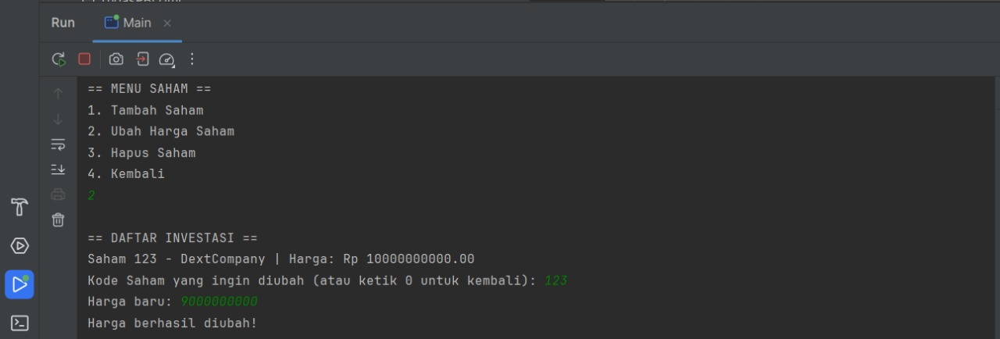 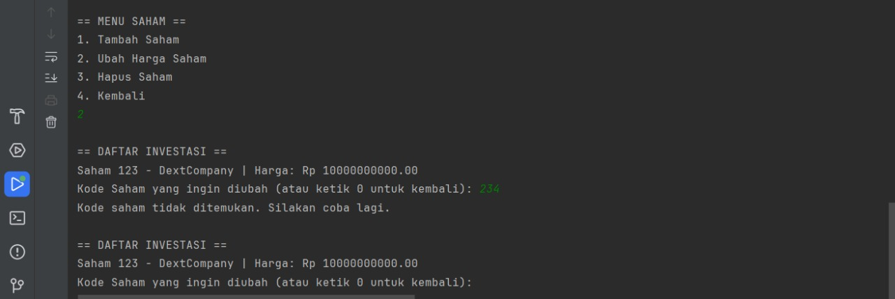


Gambar di atas merupakan tampilan ketika pengguna menginput opsi 2 pada **Menu Saham** yaitu mengubah harga saham yang tersedia. Pengguna akan memasukkan kode saham yang sesuai dengan saham yang tersedia lalu mengubah harganya. Jika pengguna salah memasukkan kode saham, maka akan muncul peringatan **Kode Saham Tidak Ditemukan** dan akan kembali ke tampilan untuk mengubah harga saham. 

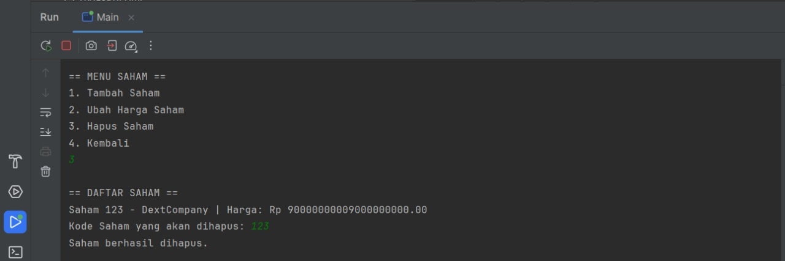 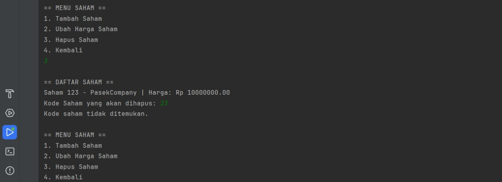

Gambar di atas merupakan tampilan ketika pengguna memilih opsi 3 di **Menu Saham**. Pengguna bisa menghapus saham yang tersedia dan ketika kode yang dimasukkan tidak ada di daftar sahamnya, maka akan muncul peringatan **Kode Saham Tidak Ditemukan** dan program akan otomatis kembali ke **Menu Saham**.

---
### 4. Menu SBN
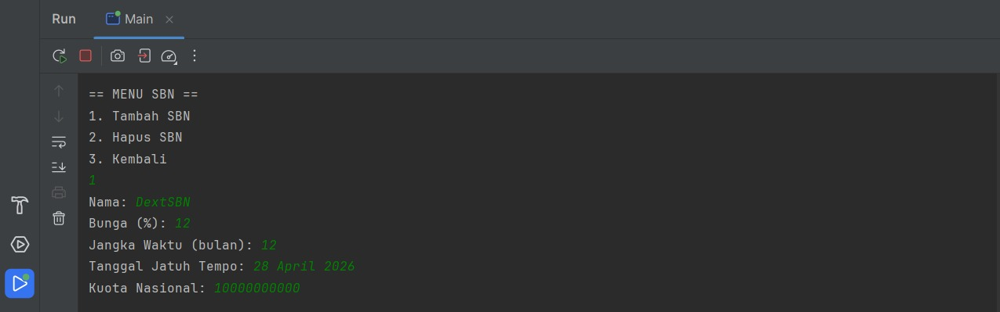

Gambar di atas merupakan tampilan Menu SBN. Terdapat 3 opsi pada menu tersebut, yaitu **Tambah SBN**, **Hapus SBN**, dan **Kembali**. Untuk menambah SBN, pengguna dapat memilih Opsi 1 dan mengisi data-data yang diminta oleh program. Ketika sudah, program akan otomatis kembali ke **Menu SBN**

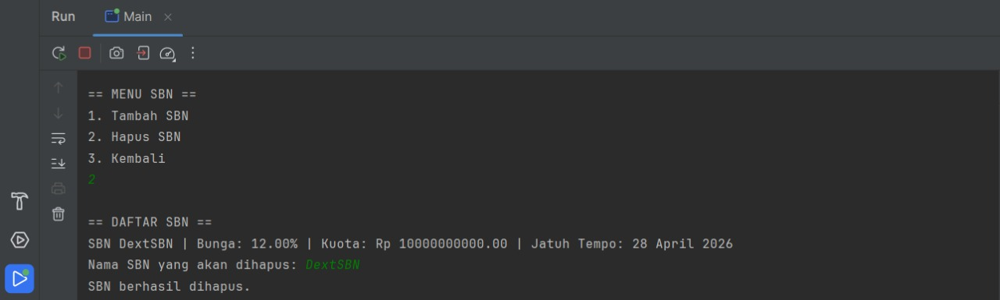

Gambar di atas merupakan tampilan jika pengguna memilih opsi 2 untuk **menghapus SBN**. Ketika pengguna salah memasukkan nama SBN, maka akan muncul peringatan **Nama SBN tidak ditemukan.**.

---
### 5. Daftar Investasi
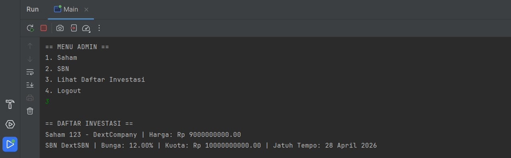 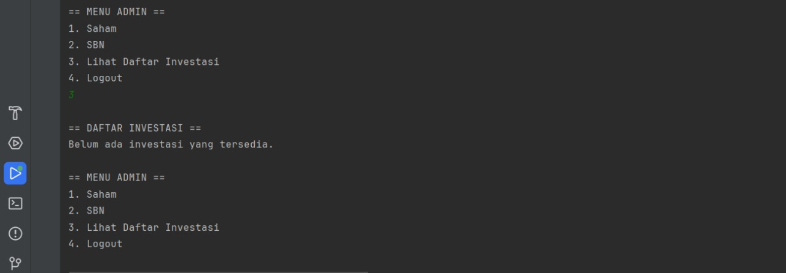

Gambar di atas merupakan tampilan Daftar Investasi yang tersedia jika pengguna (admin) memilih opsi 3 pada **Menu Admin**. Jika daftar investasi masih kosong, maka akan muncul pesan **"Belum ada investasi yang tersedia"**.

---
### 6. User Login
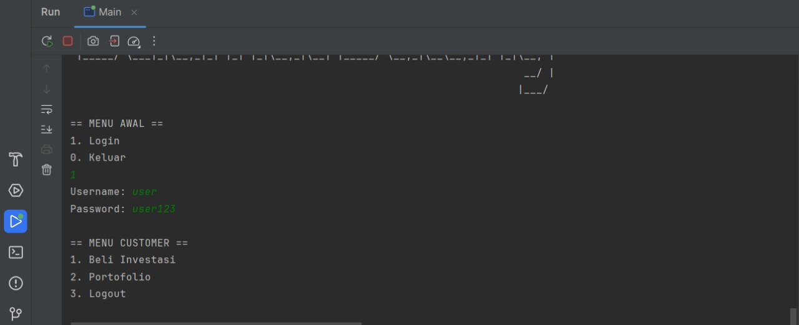 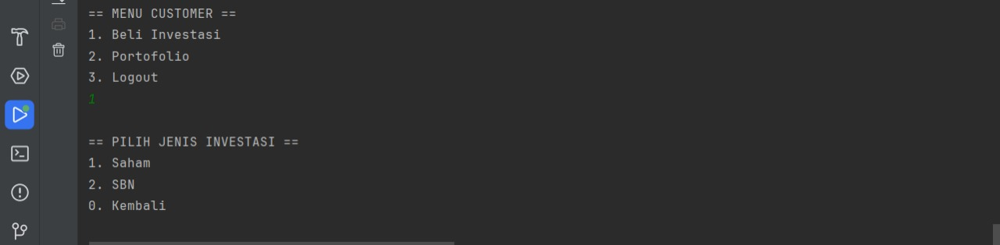

Gambar di atas merupakan tampilan User Login serta Menu Customer. Pada Menu Customer terdapat 3 opsi, yaitu **Beli Investasi**, **Portofolio**, dan **Logout**. Masukkan opsi 1 jika pengguna ingin membeli investasi dan akan muncul tampilan menu **Pilih Jenis Investasi** yang berisi 2 pilihan yaitu **Saham** dan **SBN**.

---
### 7. Beli Saham & SBN
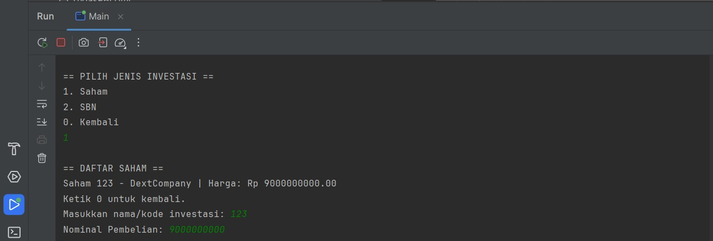 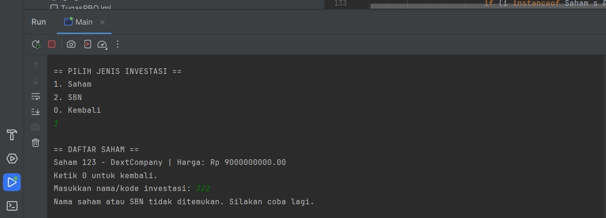

Gambar di atas merupakan tampilan jika pengguna memilih opsi 1 untuk **membeli saham**. Daftar saham akan muncul dan pengguna akan memasukkan kode saham yang ingin dibeli. Jika kode yang dimasukkan tidak ada, maka akan muncul pesan dan program akan meminta pengguna untuk mengisi ulang kode saham yang terdaftar.

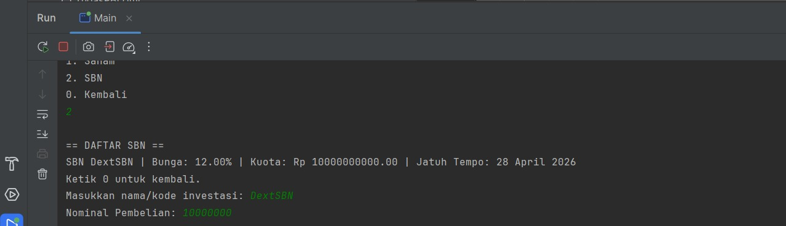 

Gambar di atas merupakan tampilan jika pengguna memilih opsi 2 untuk **membeli SBN**. Jika Penggguna salah memasukkan nama SBN yang tersedia, program akan menampilkan peringatan "**Nama saham atau SBN tidak ditemukan. Silakan coba lagi.**"

---
